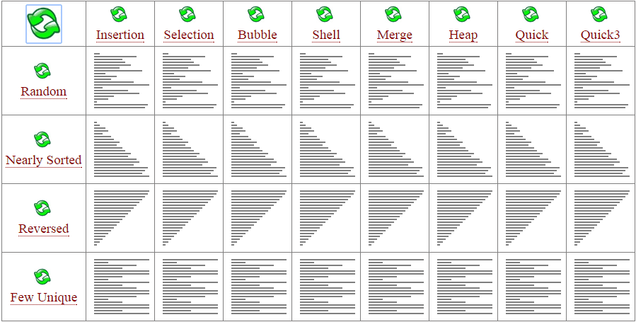
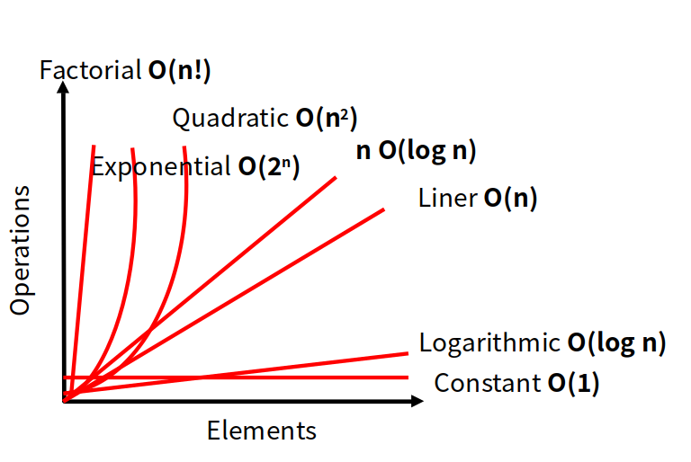
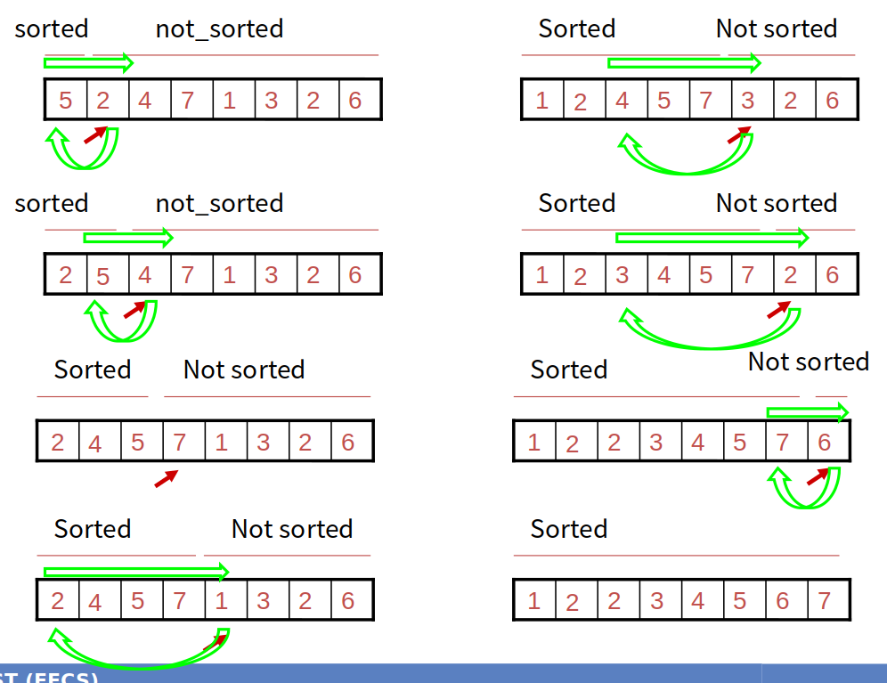

> in Assignments use python sorting packages.

> 7 todos left.

# What is algorithm?

Set of computational steps, that transforms input to output. 

### remark
There needs input (or not), and output is a **must**.

### properties
Algorithm needs to be
* definite: each steps should be meaningful
* finite: should be finished at some point.
* effective : it has to do the task effectively.

### What problems does Algorithms solve?
* routing algorithms
* search engines
* public key cryptography
* maximizing profit
* et cetra

### What is different from Data structure class?

|-|data structure|algorithms|
|-|---|---|
|Definition|way to organize data|procedure for performing task|
#todo : difference between data structure and algorithms

needs good data structure knowledge in order to build a good algorithms. It will **help**. 

### Caution
Needs data structure knowledge after finals.

# Algorithms - Sorting

* insertion, selection, bubble, shell, merge, heap, quick, quick3

How do you say one algorithm is better than the other?
**The number of primitive operations** needed.
We express with **big-O notation**.

# Big-O notation
mathematical notation used to classify algorithms according to **how their run time grow as the input size grows**. 

ex1. get_first_number function needs 1 operation : constant : **O(1)**
ex2. summation function needs n operation : **O(n)**
ex3. Sequential search : n operation :  **O(n)**, linear time complexity
ex4. Binary search(just like we search on dictionary) : log n operation :  **O(log n)**
ex5. brute force : **O(n!)**, worst.

**caution.**
we can only use binary search only when the input is sorted. In other words, input is sorted beforehand.

memo. runtime complexity, space complexity

### Comparison between Big-O notations

# Insertion Sort
>**Find a spot and shift.** 
> for each unsorted data array, we choose where to **insert** in the sorted data array.

this alg. divides data into two parts: sorted and unsorted.

compare with each sorted data **backwards** (biggest first).
if the sorted datum is bigger, shift to right.
else if the sorted datum is smaller, put the target to the place. 

#todo : implement pseudocode.
#todo : implement code.

### time complexity : $O(n^2)$
#todo : how to prove?
# Merge Sort
> **divide and conquer**

## What is Divide and Conquer?
you divide problem into multiple subproblems. 

**remark**
subproblems should be the similar problem of the bigger one. 
divide and conquer is *recursive* in nature. 

#### steps.
Divide : divide problem into smaller subproblems.
Conquer : when the subproblem is small enough, solve in *straight-forward manner*. 
Combine : obtain bigger solution with smaller solutions.

#todo : implement merge sort pseudocode.
#todo : implement python code.

### time complexity : $O(n*log(n))$
#todo : how to prove?