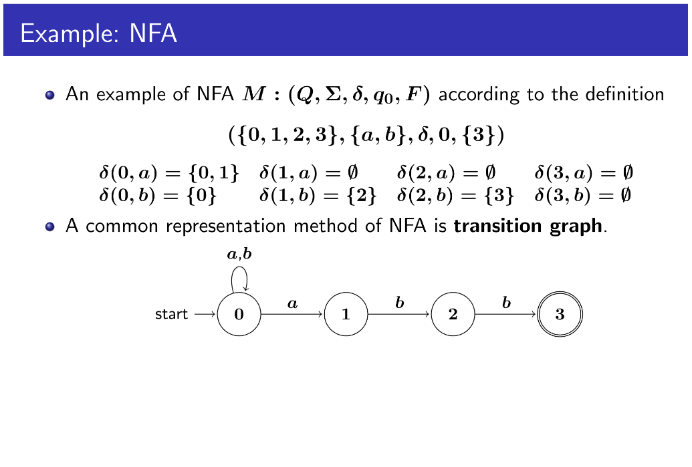

# RECAP
* Language is a set of strings.
* **union is not concatenation!!!** Don't be confused.
*  union : 합집합 해서 넓히기, concat: 글자 길이 늘리기.

* $L^*$, The Kleene closure of language $L$
* $L^+$, the positive closure.

# Regular Expression
* notation that denotes the type of a language.
* defined by either in bases cases or in inductive cases.
* $R_1 | R_2$, $R_1 \cdot R_2$, $R_1^*$ 

**************
# String Recognition by Finite Automata

## Finite Automata
* String recognizers that return either Y/N.
* 2 types; NFA(nondeterministic FA), DFA (deterministic FA)
* Since every language that is defined by regex can also be defined by its corresponding NFA or DFA, we can use FA to accept valid lexical patterns.

# NFA
$$ M = (Q,\Sigma,\delta,q_0,F)$$
$Q$ : 가능한 상태들의 집합.
$\Sigma$ : 알파벳.
$q_0$ : 시작하는 상태.
$F$ : final states. denote it with double circle.
$\delta$ : 지금 상태에서 특정 input을 받았을 때 상태가 어떻게 바뀌어야 하는지 나타내는 transition function.

# Language defined by its NFA
* About the transition graph above, it is
* $L(NFA) = L((a|b)^*abb)$
* any strings that are made with $a$ or $b$ and ends with $abb$ .

# String recognition by NFA
> NFA accepts a string $w$ if and only if there is a path from start to final states in the transition graph.

# DFA
* a special case of a NFA.
* we don't use $\epsilon$ move.
* For each state and input symbol, next state is unique. (transition function denotes every possible moves. it is a total function.)
* If you choose to express a regex with DFA, make sure it is a total transition function.

## Why do we NEED to use DFA rather than NFA?
There's nothing wrong in using NFA. However, the efficiency of DFA is better (in use).

Note that the construction cost of DFA is expensive than NFA.
한번 고생해서 DFA 만들어 놓으면 오래오래 사용하니깐 멀리 봤을땐 편하다~
(반대로, `grep` 처럼 한 두번 사용할꺼면 NFA 가 나을지도.)

