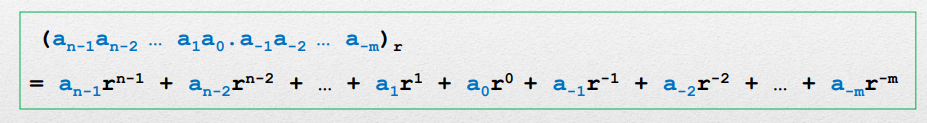

# Introduction 

>**Summary**
>

>**keywords**
>

>**TODO**
>

> **HW**

>**Exercise*** 
>

> **Next time**
> 

**********
# Information Representations (Cont'd)

## What is a Base-r system?
> Nam's note, Lec. 2 page 15 

**concept is the number. **
** Its representation written down works on base-r system. **

### How do we convert into new base system?
> divide by base, and remainder repeatedly is written from the right.

#### How do we do conversion easily on our brain?
subtract the biggest subtractable geometric progression of the base.

## Fraction conversion
> multiply by base, and take the integer.

>The only purpose of using octal numbers or hexadecimal is for compression

# complements
### Diminished radix complement
* (r-1)'s complement of N :
	$(r^n-1)-N$
* r's complement of N:
	$(r^n) -N$

