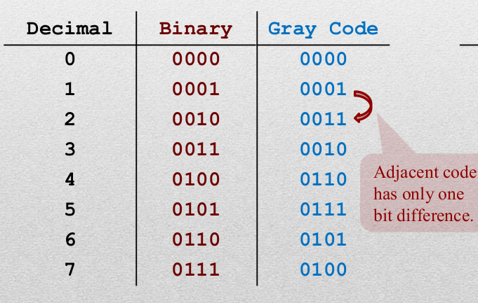
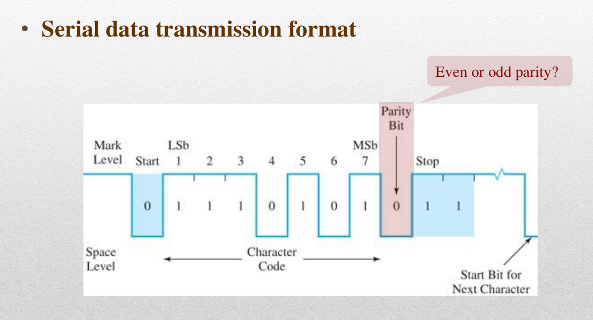

# Introduction 

>**Summary**
>

>**keywords**
>

>**TODO**
>

> **HW**

>**Exercise*** 
>

> **Next time**
> 

**********
## Gray code
> The codes are sequenced so as the adjacent code has only one bit difference.

### Why do we need concept of gray codes?
* To detect **how many bits are corrupted** in the data.
* When the data is changed, the value difference is equal to the number of corrupted bits.

## Error Detection Codes
1. Parity bits
* It adjusts so that the number f 1s in a group to be even(even parity) or odd(odd parity)
* It cannot correctly detect multiple bit errors.
* It cannot fix errors.

## Serial Data Bit representation

 
****************
# Boolean Algebra

## Diagrams, truth table, and function.
* The dot symbol stands for 'not' operation; the triangle symbol stands for 'buffer' operation. Combined, it means 'not' operation.
* truth table is the only definitive way to express operation.
* truth table uses "HIGH", "LOW", "X" as the entity(Due to the underlying hardware tech).
* X means either Low or high logic level: Don't care condition

* not is typographically expressed in prime or overbar.
* overbar is a complement expression.

## useful two-binary-variable operations
* AND $F(x_1,x_2) = x_1 x_2$
* OR $F(x_1,x_2) = x_1+x_2$
* XOR (OR, but not both) $F(x_1,x_2) = x_1⊕x_2$
* NAND 
* NOR
* E-XOR

* NAND, NOR has duality
* All the other operations can be implemented with NAND and NOR gates; it is universal.

## Logic Circuits
There are canonical form or others.
Canonical form definitively expresses truth tables.

## Basic Axioms of Boolean Algebra
* only concerns three operations only (AND, OR, Complement)

