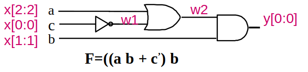

# Introduction 

>**Summary**
>

>**keywords**
>

>**TODO**
>

> **HW**

>**Exercise*** 
>

> **Next time**
> 

**********
## Axiom Simplification

## Which circuit is better?
* Informality
* data propagation - concerns because of heat.

# Verilog

## module creation
```verilog
module circuit1(y,x);
	input [7:0] x; output [7:0] y;
	wire w1, w2;

	not G1(w1, x[0:0]); //first argument is output, others are inputs.
	or G2(w2, x[2:2],w1);
	and G3(y[0:0],w2,x[1:1]);
endmodule
```

* (recommended) gate declaring convention : write the wiring in the order of direction input to output.
* (recommended) define input and then output.
* there are pre-defined operation keywords, such as `not`,`or`, `and`. 
* module is a function. keyword `module`. 
* `[7:0] x` means that the array of input needs 0 to 7, with `xxxxxabc` for each index.(x is don't-care notation)
* `[startbit:endbit]`, with `endbit-startbit+1` bit size. 
The following exactly expresses the same thing as the gate definition on the previous code.
```verilog
always @(*) begin
	case(x)
		2,6,7: y[0:0] =1'b1;
		default y[0:0]=1'b0;
	endcase
end
```
## main module
```verilog
module circuit1(y,x);
	input [7:0] x; output [7:0] y;
	wire w1, w2;

	not G1(w1, x[0:0]); //first argument is output, others are inputs.
	or G2(w2, x[2:2],w1);
	and G3(y[0:0],w2,x[1:1]);
endmodule

module main();
	integer i;
	reg [7:0] x; //register. variable that can be changed. mutatable.
	wire [7:0] y; 
	circuit1 c1(y,x); //instantiating a circuit but not calling the circuit.

	initial begin
		$display("%4s  ","time x2 x1 x0 y0");
		// generate output whenever a mutable data is changed.

		$monitor("%4t  %2b %2b %2b %2b", $time, x[2:2],x[1:1],x[0:0],y[0:0]);
		//this is generating a truth table for this circuit1.
		
		for(i=0;i<(2**3);i=i+1)
			begin
				x=i; //take i as an integer, and convert it to binary array.
				#1;
			end
		$finish;
	end
endmodule
```

* signal : 0,1 value. cannot take two states at the same time.
* `$` sign stands for a macro function. `$display` stands for `printf` in c.
* `#` sign stands for operator of delaying time. `#1` means to delay time by 1 time step.

## To run with Icarus Verilog
```bash
iverilog -o file.vcd file.vl
vvp file.vcd
```
