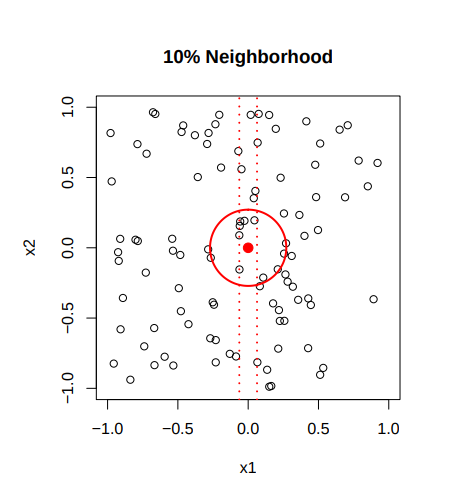
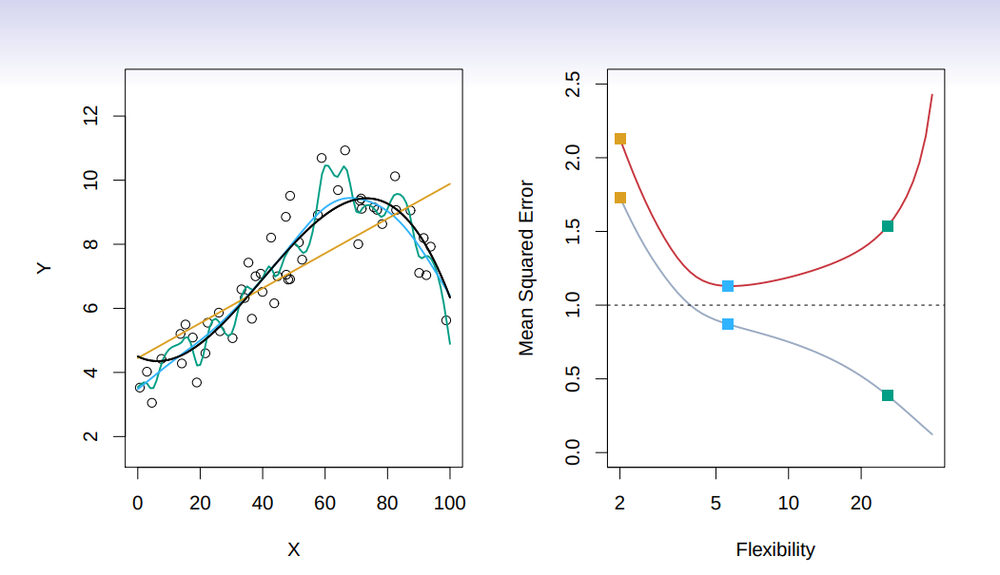

# Introduction 

>**Summary**
>

>**keywords**
>

>**TO-DO**
>

> **Homework**
> 

>**Exercise*** 
>

> **Next time**
> 

**********
# What is Statistical Learning?

> Predicting the target variable (Y) by the relation with inputs($X_i$)

* How can we find the predicting function $f(X)$?
* How can we prove the function $f$ is a "well-predicting function"?

## Function Confirmation
* **evaluate the error** from the differences between function value and the actual observed value.
	* i.e. function that minimises **mean-squared prediction error** $E[(Y-g(X))^2]$ over all function $g$
* **irreducible error** 감소시킬 수 없는 에러 : $\epsilon = Y-f(x)$ ; even if we find $f$ there would still be errors in prediction due to the noise in $X$
$$E[(Y - \hat{f}(X))^2 |X = x] = [f(x) − \hat{f}(x)]^2 + Var(\epsilon)$$
* ($\hat{f}$ is my function I am constructing, $f$ is the ideal predicting function we want to find.)

### Introduce the concept of Neighbourhood 
* when there's no Y observed value for a specific X 
* (too sparse data pool)
* Select a neighbourhood $N(x)$ around $x$
* get the average of $Y$s of any existing $x$ in the neighbourhood $N$
$$f(x) = Ave(Y |X ∈ N (x)) $$
##### What if there is no neighbour?
 * When does it happen?
	* When the dimension of features(number of features) is too many. Nearest neighbours tend to be far away in high dimensions. 
	* In the data below, when you choose to take 10% of the data with linear boundary, it is small(the distance between two dotted lines) while it is bigger in 2-D (the radius of red circle)
	
	* When you are at the boundary.

## Finding the function
> set a model you predict the function would look like.

### 1. Linear model
$$f_L(X) = \beta_0 + \beta_1 X_1 + \beta_2 X_2 + . . . \beta_p X_p$$
we are looking for the coefficient $\beta_i$ . 
### 2. Quadratic model maybe better..

### 3. Multiple variables could over-fit, less flexible...

## Trade-offs
* accuracy vs. interpret-ability(이해/연산하기 쉬운)
* Parsimony(절약한) vs. black-box(개복잡한)

* when the truth curve is linear, linear model could be flexible.
* If not, higher dimension model could fit better.*

Red line is test dataset errors, gray line is training dataset errors. Although green performs better than blue in training cases, it will be less confident in general test cases.

