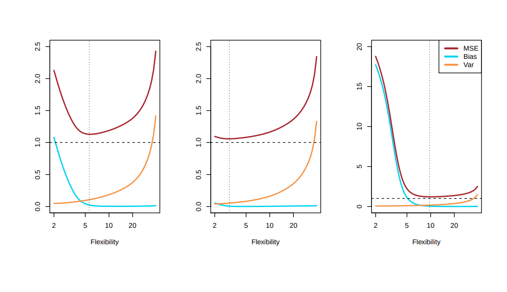
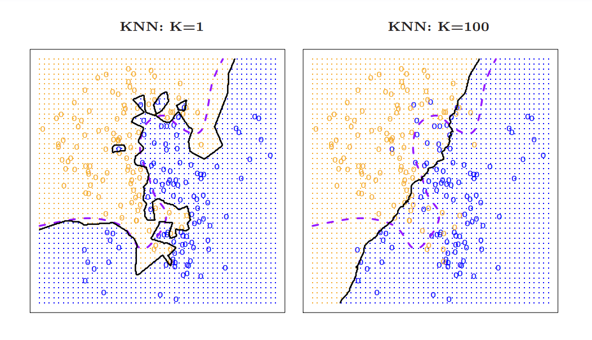
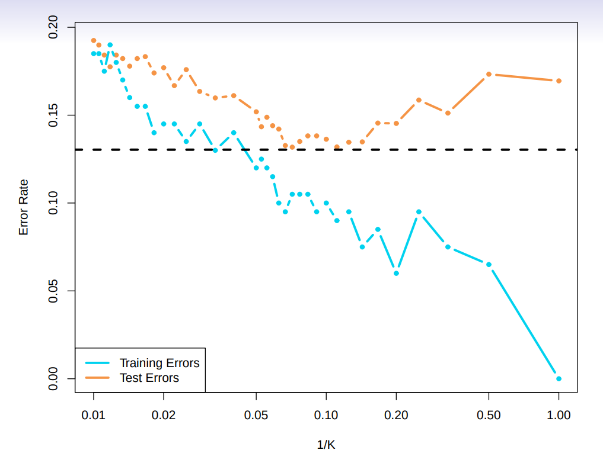

# Introduction 

>**Summary**
>

>**keywords**
>

>**TO-DO**
>

> **Homework**

>**Exercise*** 
>

> **Next time**
> 

**********
# Bias-Variance Trade-off

$$ E(y_0+\hat{f}(x_0))^2 = Var(\hat{f}(x_0)) + [Bias(\hat{f}(x_0))]^2 + Var(e)$$

Variance occurs because we make the function with only sampled datasets. 
Bias occurs because we try to make the function as simple as possible. (generally, flexible model has small bias)

irreducible error is shown as dotted horiziontal line.

## Classification Problems
how are we going to classsify =/ldata in the greyszone
l. miscalculating average clock

KNN stands for K- nearest neighbours. Check k nearest neighbors and see if which sided data is more

KNN : K =1 is too flexible ; it is prone to outliers
KNN : K = 100 is too rigid ; This has bigger bias??

**How can we decide the good k value?**
* save some portion of the data for test data. 
* Use the other portion of data as a training data.
* The sample percentage will affect the choosing of $k$.

****************

# Linear Regression

Assume a model $$Y = \beta_0 + \beta_1X +\epsilon$$
we want to find the intercept and slope.

We introduce a residue, the difference of the model-predicted data and the real one. 
$$e_i = y_i - \hat{y}_i$$

Lets minimise the sum of squares. RSS(residue sum of squares).

$$RSS = (y_1-\beta_0-\beta_1x_1)^2 +(y_2-\beta_0-\beta_1x_2)^2 + \ldots + (y_n-\beta_0-\beta_1x_n)^2$$

By partial differentiating with $\beta_0$ or $\beta_1$, we can find the point where $RSS$ is smallest.

$$β_1 = \frac{\sum^{n}_{i=1}(x_i - \bar{x})(y_i - \bar{y})}{\sum^{n}_{i=1}(x_i - \bar{x})^2}$$ $$β_0 = y − \beta_1x$$
95% confidence 