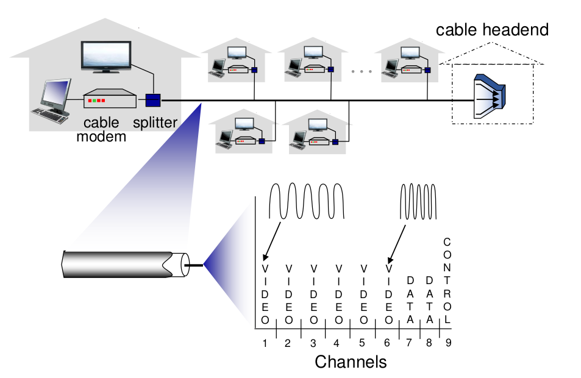
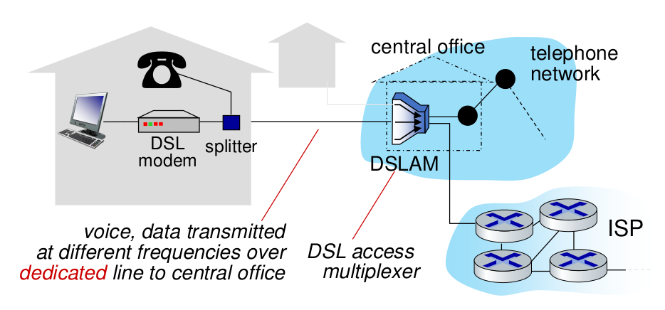
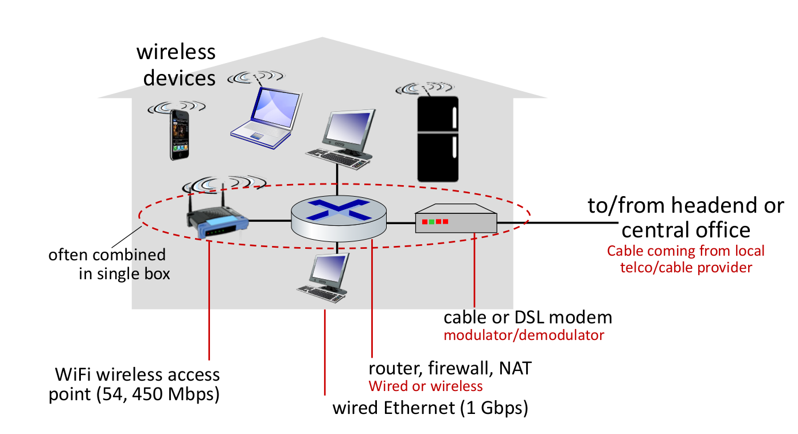
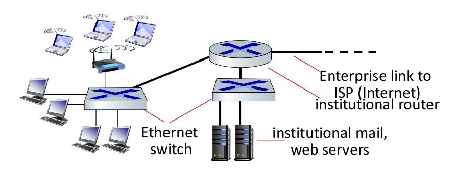
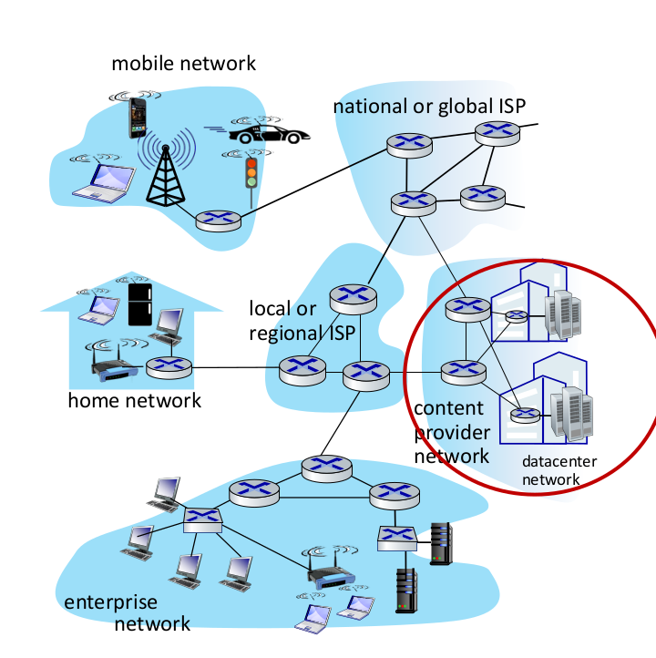

# Introduction

>**Goal**
>feel the big picture of computer networks

>**keywords**
>Internet, protocol, network edge, network core, performance, protocol layers, service models.

> HW :
> what ISP is servicing GIST college?
# Internet : nut and bolt view
> Network = Edge devices + core + links

**Edge devices**
All devices we usually use.

**Core**
Packet switches, routers ..
	**ISP** : Internet service providers 
	ex. KT, SKT, LG U+

**Links**
There are different structures of communication links (optic fiber, copper, radio ..)
links between switches

**Network**
All of these(Edge devices, core, links) make of the whole network
All these networks are connected by ISP 

> **Internet is a network of networks. Interconnected ISPs**

**Protocols**
Every rules between devices are written in RFC(Request for comments).
IETF(Internet Engineering Task Force) writes RFCs.

# Internet : service-wise view
What services are built upon internet?
Web, streaming video, email, social media, cloud computing ...

Internet provides programming interface(background) between distributed devices. 

# What is a protocol?
Protocols define the format, order of messages sent and received among network entities, and actions taken on msg transmission, receipt

# Network Edge
hosts : clients and servers
**caution**. servers are also at the edge of a network.

## Access networks 
network that connects edge hosts to the networks

### cable-based access
* this access networks work based on **FDM(Frequency division multiplexing)**
	#todo : What is FDM?
	#todo: What is multiplexing? A way of sharing one channel between services. we divide by frequency, time slot, or others..
	 
* They use HFC(hybrid fiber coax) for linking. Asymmetric in downstream/upstream transmission rate

### digital subscriber line(DSL)
This DSLAM works upon the existing landline telephones infrastructure.

### Home networks

*Central office* is a commonly used term. 

### Enterprise Networks

Mix of wired, wireless networks.

### data center networks

Supported by *high bandwidth* for more availability
often merged with a CDN. A company that needs big size data center buys CDN and build themselves. 

## Transmission taking time
* sent target is divided into chunks, (usually called packets)
* Let each chunks have size $L$ bits.
* chunks are sent through link.
* Each links have their own transmission rate $R$.
*	$$(packet\: transmission\: delay) = time\:need\:to\:transmit\:L-bit\:chunk = L/R$$

## Links : physical media
Twisted pairs (TP)
Coaxial Cable, Fiber optic cables, ...

### Links : wireless media
frequency division is made by the goverment, or on RFC.

# Network Core
Core is made of interconnected routers. 
The routers make up packet-switching network.

>The network forwards packets from source to destination. 

**The main task of routers**
Routing : to find the path
Forwarding: forward the packet that way

The information of destinations are padded inside the packet.
Routers build forwarding tables through an routing algorithm, 
and according to it router forwards the packet.

## Packet switching : store-and-forward
#todo : transmission delay, end-end delay

## Packet switching : queue

There exists a queueing delay.
If the queue storage is full, it commits **packet drop**

![[../images/20230831140901.png]]
#todo: write about throughput, packet drop rate.
## Circuit Switching
used mainly in **telephone networks**.

make a call setup. it takes a certain amount of time.
the line is reserved for my call.
we use the line solely for my call.

**benefits**
guaranteed performance. (no other interference)

How do links perform multiplexing?
FDM: I use 100MHz bandwidth, you use 200MHz bandwith
TDM : Me first, you next.
![[../images/20230831141647.png]]

