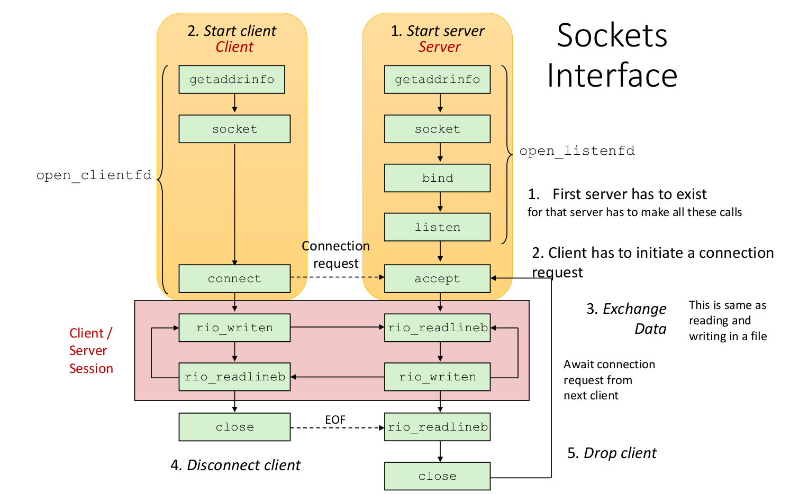

>**Summary**
>

>**keywords**
>

>**TODO**
>

> **HW**

>**Exercise*** 

> **Next time**
> 

*********
# Recap

## Socket programming
Why do we learn this?

If you do not denote the serverPort, it is a loopback, also called localhost. 

decode is required to make binary sentences into strings. 

Accept will accept the connection requested by client call `clientSocket.send()`.

## difference in TCP & UDP
* There is connection establishment in TCP. (shown in accept call)

#todo : add System theory practice book, Programmer's Perspective 

*****
# Multiplexing using Sockets
> Let's support multiple clients.
> How one-process one-server can support multiple clients?

We will focus on...
* one process
* sequential manner
* First-come-first-served manner

### Multiplexing
Many people are sharing a particular media.

>all sockets are files.
## Three system calls for implementing multiplexing.
> `socket()`,`accept()`,`select()`
### `socket()`, `accept()`

1. Creating Master Socket `Socket()`
* *`Socket()` will create and return Master Socket(Master file Descriptor, like a pointer).
* `serverSocket = socekt(AF_INET,SOCK_STREAM)`

2. Master Socket is responsible for connection request.`accept()`
* For each acceptance of request, master socket will create communication socket (Communication file descriptors).
* *`serverSocket.accept()` returns client address(IP+port), and the communication socket
* If second client requests, Master socket will accept, and create another communication socket. with, *this* socket, further communication is made. 
* `accept()` is for 3-way handshake.

3. Each Communication Socket is responsible for Service request(Further communications).
* Further communication will be handled by each communication socket.

### `select()`
* a waiting(blocking) system call. 
* for monitoring all client activity.
* monitoring all socket File Descriptor list (Master socket, communication sockets)
* in the argument, list of sockets are requested.
* monitoring all connection request, service request.
* `select()` unblocks when
	* New connection request arrives
	* New Service request from existing client arrives.
* will return a particular **socket** that needs an activity.

## Example codes: Chat application

listen 5 connections
prepare a list `inputs[]` of socket FDs.
While there is a element in `inputs[]`,

if s is server : if s is a master socket

