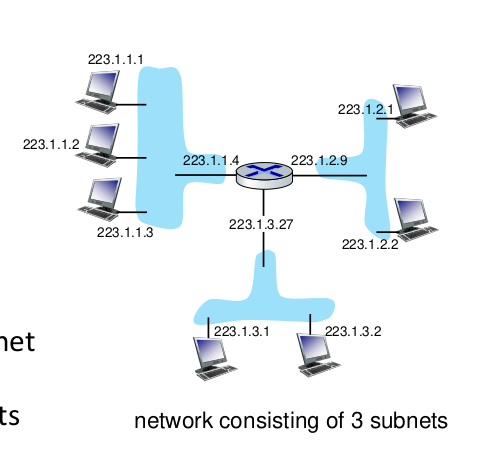

# Introduction 

>**Summary**
>

>**keywords**
>

>**TODO**
>

> **HW**

>**Exercise*** 
>

> **Next time**
> 

*********
# IP
## IP datagram
TTL : prevent looping. (not usually occurs because network is hierarchical)
type of service

Overheads
* 20 bytes of IP header,
* 20 bytes of TCP header.

## IP fragmentation
Network links have max transfer size (MTU)
**IP fragmentation can occur at any router** 
**IP assembly always happen only at the last router.**

3 fields on header
16 identifier, flags, offset 
fragflag 0 indicates the last fragment.
fragmentation was about the flow capacity.
offset - size

where fragmentation happens? depended on the size?
## IP addressing
32 bit identifier with each host or router **interface**
IP address is associated with an interface, not a device.

router also has interface. 
#test: prefix matching problems

* virtual network interfaces
	By default, 192.168.56.1 is the IP address assigned for Ethernet adapter to virtual box.

There's Layer 2 device (called hub) on blue areas

## subnets
`223.1.1.X`, `223.1.3.X`,`223.1.2.X` is a subnet address part.

subnet is indicated by subnet mask.
one device can be in several subnet, each adapter to each subnet.

for `223.1.3.0/24`, `/24` part means 24 bits in front are for subnet address.

# CIDR (Classless InterDomain Routing)
subnet portion can be of arbitrary length
>a.b.c.d/x

## How do you get IP address?
* How does __host__ get their IP?
	* Option 1) Hard Coded in config file
	* Option 2) Dynamic Host Configuration Protocol(DHCP)

* How does __network__ get their IP?
	* gets allocated portion of its provider ISP's address space

## DHCP
It is a __Application layer protocol__.
Goal
* can renew its lease(time duration of borrowing) on address in use
* allows reuse of address.
* support for mobile users who join/leave network.

* discover, offer, request, ack

### DHCP scenario
* There's a DHCP server connected in the network.
* DHCP broadcast : broadcast send to `255.255.255.0:67` IP.
	* src:0.0.0.0,68
	* dest:255.255.255.0,67
	* yladdr: 0.0.0.0
	* transaction ID:654
* DHCP server serves at port 67.

* DHCP Offer : How about `<address on yladdr>` this IP?
	* src:223.1.2.5,67
	* dest:255.255.255.0,68
	* yladdr: 223.1.2.4
	* transaction ID:654
	* lifetime: 3600 secs
* destination is till broadcasting.
* The client recognizes the offer by transaction
* there is a lifetime

* DHCP request : OK, can I use it?
	* src:0.0.0.0,68
	* dest:255.255.255.255,67
	* yladdr: 223.2.3.4
	* transaction ID:654
	* lifetime: 3600 secs

* DHCP Ack : yes, you can
	* * src:.0.0.0,68
	* dest:255.255.255.0,67
	* yladdr: 0.0.0.0
	* transaction ID:654
	* asdfaf?

> normal mobile device only uses request, ack. They only use their address saved in client device. They only confirms if the

## DHCP sends more info other than IP.
* first-hop router
* local DNS server IP
* network mask

## How does network get subnet part of IP?
* ISP bought a portion of address space.
	ex. **11001000 00010111 0001**0000 00000000
* ISP divides them into subnets into however they like.
	ex. **11001000 00010111 0001**0010 00000000/23
	ex. **11001000 00010111 0001**0020 00000000/23

>This way, IP is a natural Hierarchical Addressing Space.